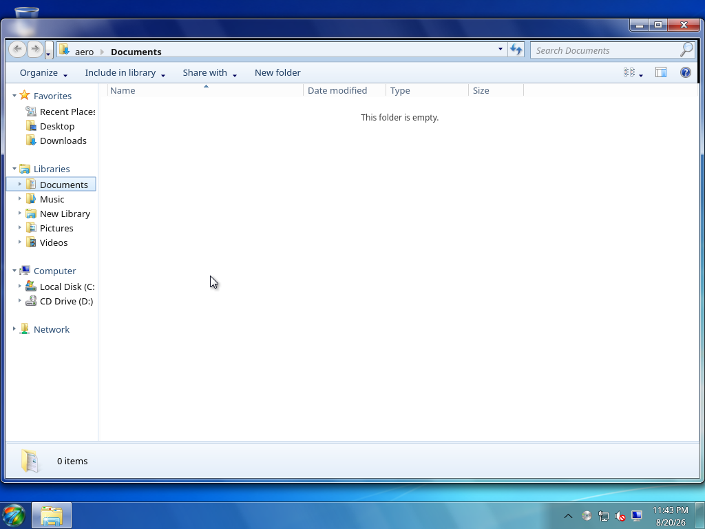

<a id="readme-top"></a>

<div align="center">


# Aero7 File Explorer

### Familiar file management for the Aero7 desktop

A maintained fork of KDE Dolphin with an independent Aero7 application
identity, Windows 7-inspired navigation, Libraries, Computer, common dialogs,
and native file-operation workflows.

[](https://archlinux.org/)
[](https://kde.org/plasma-desktop/)
[](LICENSES/GPL-2.0-or-later.txt)

[Features](#features) ·
[Documentation](https://github.com/aero7-open-project/aero7-file-explorer/wiki) ·
[Installation](#installation) ·
[Upstream](#upstream) ·
[Report a bug](https://github.com/aero7-open-project/aero7-file-explorer/issues/new)

</div>

---

**Aero7 File Explorer is an independent project and is not affiliated with or
endorsed by Microsoft Corporation. Windows is a trademark of the Microsoft
group of companies.**

> [!NOTE]
> Aero7 File Explorer is included with Aero7 and maintained in the official
> Aero7 package repository. Compatibility commands are provided for existing
> integrations, but the public application identity is File Explorer.

[](https://github.com/aero7-open-project/aero7-file-explorer/wiki/Screenshots)

See the [File Explorer screenshot gallery](https://github.com/aero7-open-project/aero7-file-explorer/wiki/Screenshots)
for Libraries, Computer, Documents, and Details-view captures from installed
Aero7 virtual machines.

## About the project

Aero7 File Explorer is the complete file-management application for the
[Aero7](https://github.com/aero7-open-project/aero7) desktop. It keeps the
mature KDE Dolphin and KIO foundation while maintaining a separate Aero7
executable, desktop entry, D-Bus identity, shell contract, interface, tests,
and distribution package.

The installed application identity is:

| Component | Identity |
| --- | --- |
| Visible name | File Explorer |
| Executable | `aero7-file-explorer` |
| Desktop id | `org.aero7.FileExplorer` |
| Package | `aero7-file-explorer` |
| Compatibility commands | `dolphin`, `aero7-dolphin` |

The compatibility commands open the same Aero7 application. They preserve old
shortcuts and third-party integrations; they do not install a second file
manager or change the public Aero7 identity.

## Features

- Windows 7-inspired navigation header, breadcrumb address bar, command bar,
  navigation pane, Details layout, preview pane, and status area
- Favorites, Libraries, Computer, and Network as first-class navigation groups
- Multi-location Documents, Music, Pictures, Videos, and custom Libraries
  shared with Aero7 common file dialogs
- Integrated Computer view with live storage capacity and free-space data
  while filtering raw Linux implementation mounts
- Extra Large, Large, Medium, Small, List, Details, Tiles, and Content views
- Aero7 copy, move, rename, delete, conflict, progress, recoverable-error,
  Properties, and Recycle Bin workflows
- Open, multi-open, save, and folder-selection dialogs for Aero7 applications
- KIO-backed local, removable, trash, and supported network locations
- Separate executable, desktop metadata, D-Bus services, packaging, and tests

Unavailable operations are disabled or omitted when a correct backend does not
exist. The application does not present decorative controls as working system
features.

## Libraries and common dialogs

Libraries combine multiple real folders into one logical view without moving
or duplicating their contents. File Explorer and `aero7-file-dialog` share the
same versioned Library definitions, Favorites, Computer presentation,
navigation model, and metadata.

Third-party applications keep their toolkit's normal dialog unless they
explicitly integrate the Aero7 dialog protocol. System-wide dialog
interception is not claimed.

## Installation

Aero7 File Explorer is included with Aero7 and distributed through the signed
[Aero7 Package Repository](https://github.com/memegeko/aero7-repo).

On an Aero7 system, install or update it with:

```bash
sudo pacman -Syu aero7-file-explorer
```

The package provides the historical `dolphin` and `aero7-dolphin` commands so
the supported package transition does not leave competing default file
managers. See [Installation and Updates](https://github.com/aero7-open-project/aero7-file-explorer/wiki/Installation-and-Updates)
for verification and removal guidance.

The official package recipe is maintained alongside the rest of the Aero7
desktop stack in `memegeko/aero7-repo`. It pins File Explorer to a reviewed
source revision, builds the package for Aero7, declares the supported Dolphin
compatibility transition, and delivers updates through the normal signed
Aero7 update process. Users do not need to build File Explorer manually.

## Documentation

| Topic | Wiki page |
| --- | --- |
| Window layout and everyday navigation | [User Guide](https://github.com/aero7-open-project/aero7-file-explorer/wiki/User-Guide) |
| Implemented Aero7-owned behavior | [Feature Reference](https://github.com/aero7-open-project/aero7-file-explorer/wiki/Feature-Reference) |
| Multi-location Library model | [Libraries](https://github.com/aero7-open-project/aero7-file-explorer/wiki/Libraries) |
| Storage and navigation-pane behavior | [Computer and Navigation](https://github.com/aero7-open-project/aero7-file-explorer/wiki/Computer-and-Navigation) |
| Copy, move, delete, Properties, and dialogs | [File Operations and Dialogs](https://github.com/aero7-open-project/aero7-file-explorer/wiki/File-Operations-and-Dialogs) |
| Fork boundaries and upstream policy | [Architecture and Upstream](https://github.com/aero7-open-project/aero7-file-explorer/wiki/Architecture-and-Upstream) |
| Common problems and bug-report details | [Troubleshooting](https://github.com/aero7-open-project/aero7-file-explorer/wiki/Troubleshooting) |

The repository keeps the versioned wiki source in [`wiki/`](wiki). Changes on
the main branch are synchronized to the GitHub Wiki by the repository's
documentation workflow.

## Related Aero7 projects

- [Aero7](https://github.com/aero7-open-project/aero7) — the Aero7 operating system
- [Aero7 Desktop](https://github.com/memegeko/aero7-desktop) — desktop session and shell integration
- [Aero7 Control Panel](https://github.com/memegeko/aero7-control-panel-) — settings and configuration
- [Aero7 Package Repository](https://github.com/memegeko/aero7-repo) — signed packages and updates

## Upstream

Aero7 File Explorer is a maintained fork of
[KDE Dolphin](https://github.com/KDE/dolphin). Applicable KDE and Dolphin
copyright and free-software license notices are preserved. Historical Dolphin
class and library names remain internally where renaming would add
compatibility risk without improving the user experience.

The upstream repository remains configured as the source used to review and
adopt future Dolphin changes. See [AERO7_FORK.md](AERO7_FORK.md) for the concise
application-boundary and compatibility policy.

## Contributing

Bug reports, tested fixes, upstream sync improvements, and documentation
updates are welcome. For Aero7-specific behavior, include the package version,
Aero7 and KDE Frameworks versions, reproduction steps, location type, terminal
output, and visual evidence when relevant.

Reproduce suspected upstream Dolphin defects before reporting them to KDE.

## License

This repository preserves the per-file SPDX licensing inherited from KDE
Dolphin and its dependencies. Most application sources are licensed under
GPL-2.0-or-later; supporting components use the compatible licenses recorded
in their source headers and in [`LICENSES/`](LICENSES).

## Legal / Trademark Notice

Aero7 File Explorer and Aero7 are independent open-source projects. They are
not affiliated with, authorized, sponsored, endorsed, or approved by Microsoft
Corporation.

Microsoft and Windows are trademarks of the Microsoft group of companies.
KDE, Dolphin, and other trademarks belong to their respective owners. This
project recreates interface concepts and does not include or redistribute
proprietary Microsoft assets.

<p align="right">(<a href="#readme-top">back to top</a>)</p>
